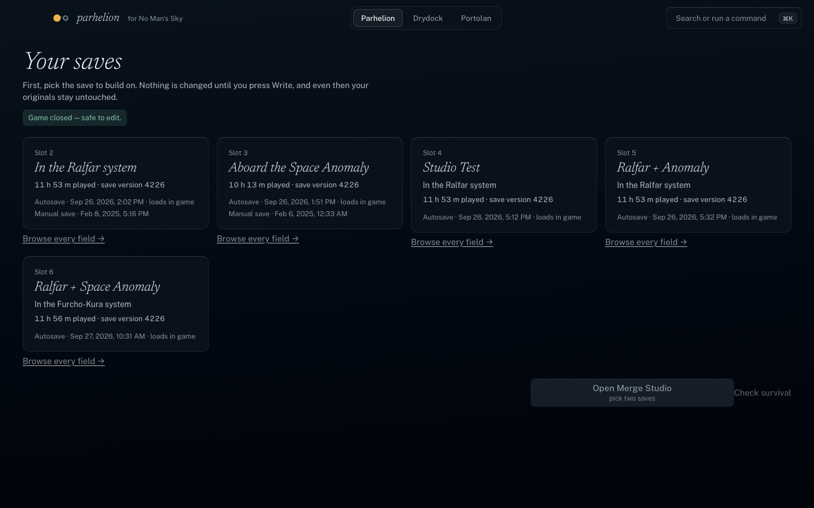
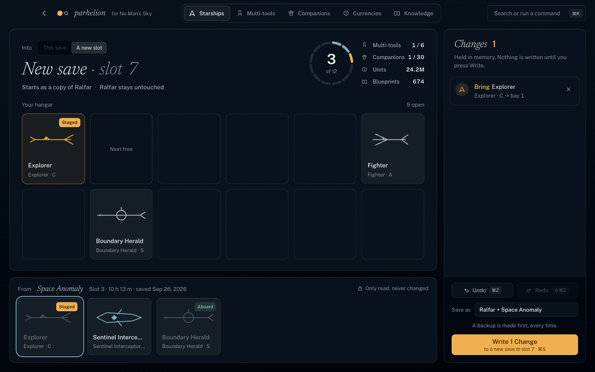
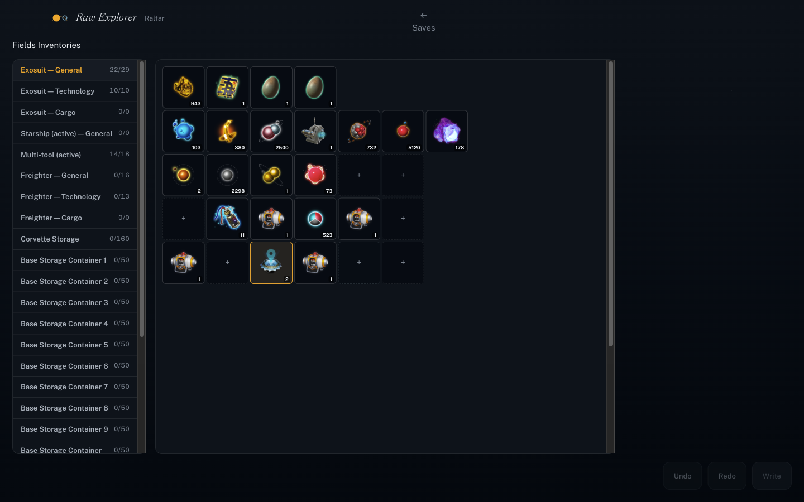

# NMS Save Studio

A native save editor for No Man's Sky, for Mac (Windows coming). Merge ships, multi-tools,
companions, currencies and knowledge between two saves, and browse or edit any field in the raw
save data — with undo, a safety net on every write, and three switchable visual themes.



## Why

Existing save editors are Windows-only or need Java installed, show raw filenames instead of your
actual ships, and have no way to combine two saves. This does that, natively, with a real UI.

## Download

**[Latest release →](../../releases/latest)** — macOS (Apple Silicon), notarized. Windows build
not yet available.

## Features

- **Merge Studio** — drag ships, multi-tools and companions from one save into a copy of another;
  merge currencies (sum, keep, or take-source) and known tech/blueprints/words; undo/redo any
  change before writing.
- **Inventory editor** — real item names, icons, and search for every container (exosuit,
  ship/multi-tool, freighter, base storage, and more): change an amount, swap an item, or fill an
  empty slot.
- **Raw Explorer** — browse and edit any field in a save, not just the categories above: search
  the whole tree, duplicate or remove array items, edit any value in place.
- **Survival check** — after loading a merged save in-game, confirm everything actually stuck (the
  game silently drops data it rejects).
- **Never touches your original save without asking** — writes go to a new slot by default; every
  write snapshots the whole save folder first and rolls back automatically if anything looks wrong.
- **Three skins** — Parhelion (default, dark), Drydock (cockpit console), Portolan (paper atlas) —
  switch anytime, same features underneath.




## How it works

Saves are LZ4-compressed JSON with a scrambled key scheme; this app parses that byte-for-byte
(never a lossy `JSON.parse`) so untouched data round-trips exactly, including numbers larger than
JavaScript can normally represent. Every edit is a semantic operation with its own undo, and every
disk write is preflighted (game not running, files unchanged since read), snapshotted, and
re-verified after writing.

## Build from source

```bash
pnpm install
pnpm --filter desktop dev        # run in dev
pnpm --filter desktop dist:mac   # build a signed .dmg
```

Requires Node 22+ and pnpm. See `CLAUDE.md` for the clean-room rules this project is built under
(no GPL code, no reuse of other editors' data files) and `THIRD_PARTY_NOTICES.md` for credited
sources.

## Status

Actively developed. Ships/multi-tools/companions/currencies/knowledge merge and the raw field
editor are working today; per-category screens for freighters, bases, and exocraft are not built
yet (use Raw Explorer for those in the meantime). Not affiliated with Hello Games.

## License

Source-available on GitHub; no license grant yet for reuse/redistribution of the code itself.
Built binaries in Releases are free to download and use.
